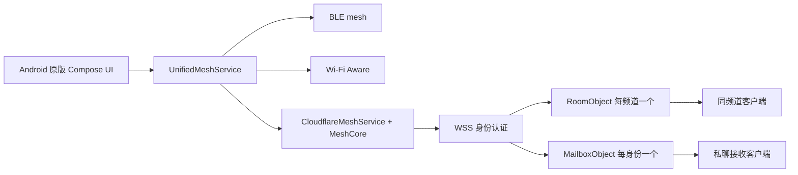

# 架构

UI 继续使用 MeshService。UnifiedMeshService 优先使用已建立的本地会话，随后选择在线会话；频道消息使用自定义封装，签名后把同一个逻辑包发送到本地与在线传输，避免双重消息。

CloudflareMeshService 使用原版 MeshCore 的 Noise、签名、回执、验证和分片接收。它关闭跨传输桥接和本地拓扑公告，按频道建立 WebSocket，不成为公共网关。近期文本同步为每个频道单独建立 gossip 缓存与过滤器，不跨频道分享缓存。

Worker 入口只验证路由、升级请求并选择对象。RoomObject 负责认证、创建者元数据和同频道广播；MailboxObject 负责身份邮箱、定向转发和有限密文恢复。对象使用 WebSocket 休眠、socket attachments、SQLite 和有数据才安排的清理 alarm。

应用显示频道在线、连接中、离线和密码状态。服务端接受、客户端传输收到、原版加密送达回执与已读状态有不同含义，不能互相替代。

## 可扩展方向

1. 先完成双机与大陆网络验收，确认前台 / 后台 / 长断网恢复。
2. 对热点频道实际测量单对象消息数、扇出、CPU 和每日额度。初始容量值可以调整；热点分片需增加协议中的订阅和成员一致性，不直接扩大计数器。
3. 若需要大附件，在独立功能开关下加入客户端加密对象存储、上传授权、过期和下载预算；R2 不属于默认免费保证。
4. 若需要推送，再明确 Google 服务覆盖、厂商限制、隐私与离线身份关联。当前只用前台服务与连接恢复。
5. 若需要更强的群组成员管理和密钥轮换，应设计独立版本的成员协议，不能把共享密码换成一个服务器访问令牌就声称具备群组前向保密。
6. 协议升级使用版本与黄金向量；DO 存储迁移保留已有标签；未来更换中继通过传输接口接入。

这些扩展不改变当前 Android 原版功能的保留目标，但需要各自的性能与安全验收。上线之前不把免费额度当作服务规模承诺。
